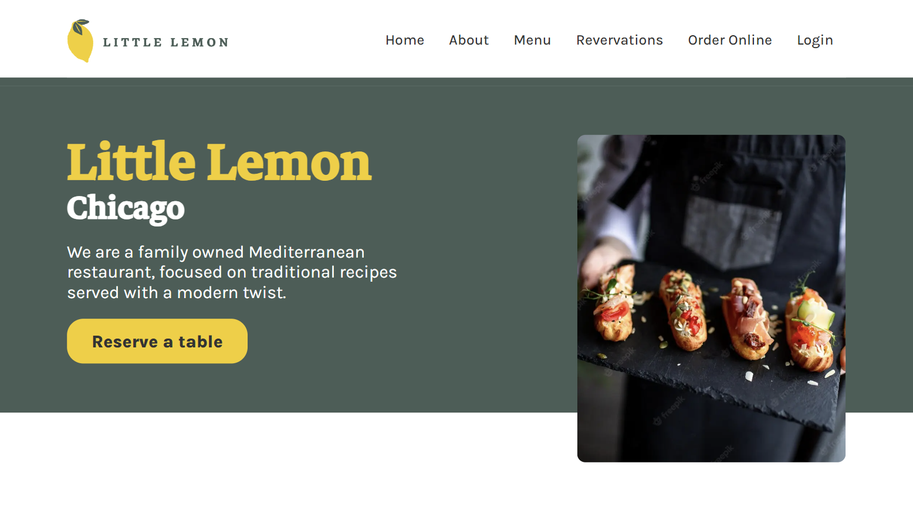

# Little Lemon

<https://little-lemon-meta.vercel.app/>

This is the 'Little Lemon' web application made for Meta Frontend assignment.

Made with Next.js - recommended React framework, TailwindCSS - default recommended option for Next.js, TypeScript - a syntactic superset of JavaScript which adds static typing which is also recommended option for Next.js.

Deployed on Vercel.

